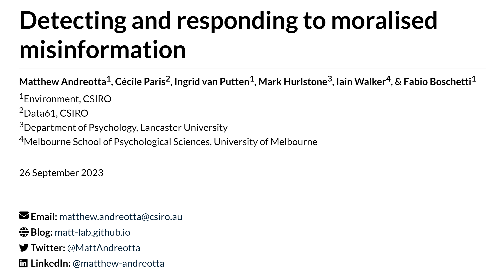

This directory contains a workshop titled "Detecting and responding to moralised misinformation", authored by Matthew Andreotta, Cécile Paris, Ingrid van Putten, Mark Hurlstone, Iain Walker, and Fabio Boschetti.
The talk was delivered by Matthew Andreotta at the University of Melbourne, on the 25th of September, 2023.

The workshop slides are available [here](https://matt-lab.github.io/workshop_2023-moralised-misinformation).

All code is licensed under the [MIT License](license_MIT) and all writing under the [CC0 1.0 Universal (CC0 1.0) Public Domain Dedication](license_CC0).

You can also click the image below to access the workshop slides:

